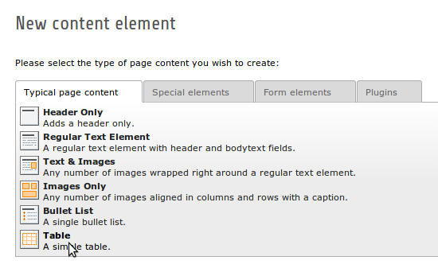
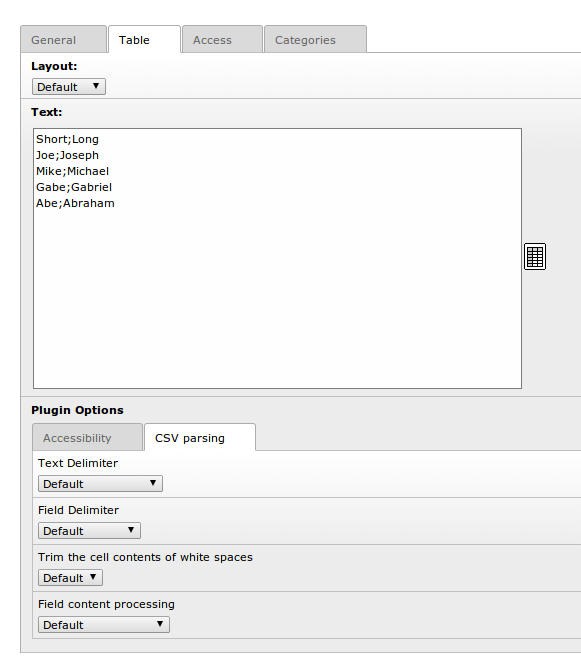
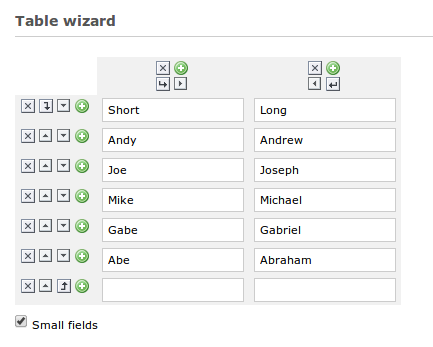

============
Users manual
============

Creating a table
----------------

Start by creating a new element and select a **Table** element in the wizard

			The new element wizard

			This view did not change. It looks and behaves exactly the way as it did before.

In the following view, the interface did not change a lot either. Some legacy settings are gone to make it clear. Change to the **Table** tab to see the options for a table.

.. figure:: Images/tab_main.png
		:alt: The main table tab

			A standard table

In the big textarea you can add rows and columns in a CSV format. See the **Settings** tab for customizing the characters used to split the text into columns and rows, or leave the standard settings.

Settings
--------

The following two settings can only be set by the content element

================   ===========================================================
Setting            Meaning
================   ===========================================================
Table caption      Insert a caption in the table. This will generate a
                   caption tag, that works similar to a h1 tag
Table summary      The content of the summary attribute. A short explanation
                   of what the table contains. Is not visible on the rendered
                   page
================   ===========================================================

For all other settings, please see the `TypoScript Reference`_, because their values are set by TypoScript if the displayed option is *Default*. Changing this will override the value set by TypoScript.

.. _TypoScript Reference: TyposcriptReference.rst

The input wizard
----------------

Right next to the textarea containing the table content, you can see a table symbol.

			Link to the table wizard

Click on it to open the wizard.

.. note::
	You must save your element once before the wizard link appears.

You will get a view similar to this:

			The table wizard

Here you see how the CSV content is turned into rows and columns. The content of the cells is inside input fields so you can edit them freely.

By default, the option *Small fields* below the wizard is selected. This means the values will be inside single - line fields. Disabling this option, will render textarea fields that allow the useage of linebreaks and larger texts.

.. tip::
	When using big fields (textarea), be sure to use a **Text Delimiter** option, other than *None*. Otherwise linebreaks in the text will trigger the creation of an additional column which will destroy the table layout.

Above every column and left to every row you can see four buttons. Those are used to manipulate the rows and columns they are in.

* The arrow buttons move rows up and down, and columns left or right.
* The plus buttons adds a row below the one you clicked, or a column right from which you clicked.
* The delete button (with the close symbol) removes the row or the column you clicked

.. warning::
	Think twice before clicking the remove button. You will not be asked for confirmation and there is no undo helper.
